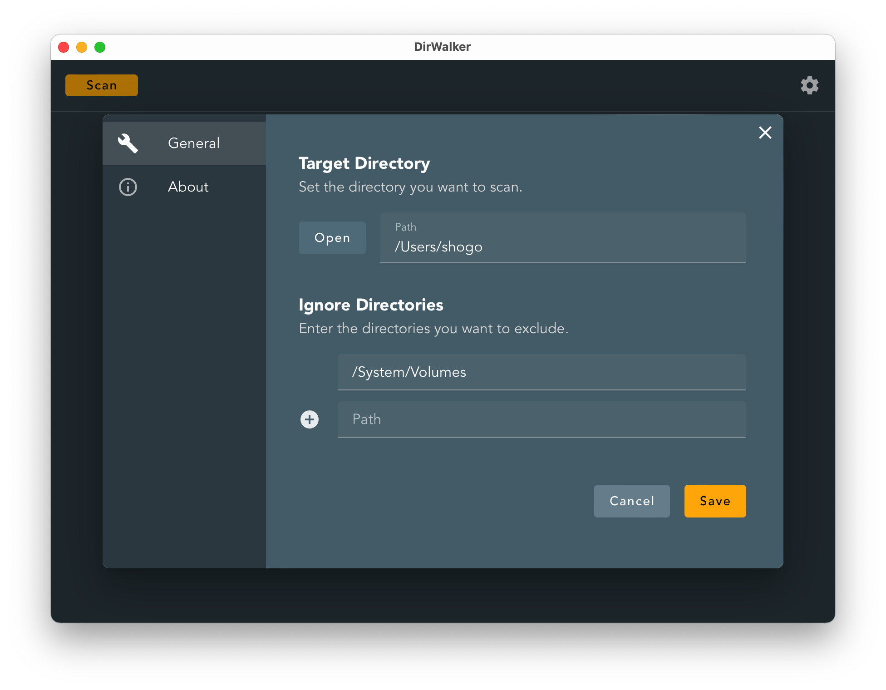
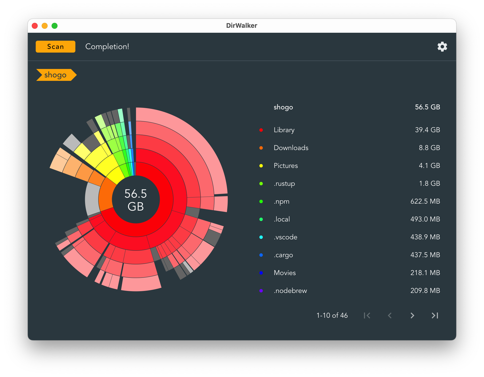
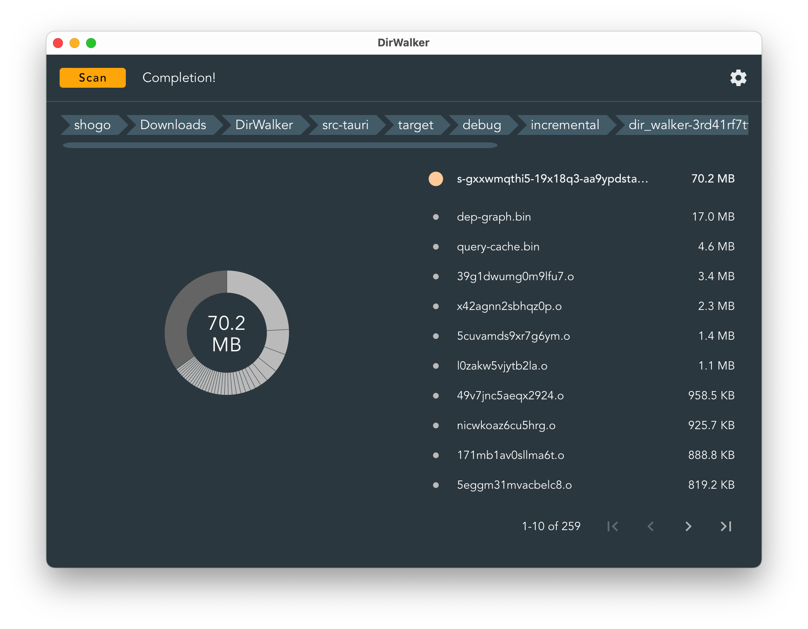

日本語版は[こちら](./README-jp.md)<br><br>

# DirWalker

<div align="center">

<br>


<br>

[](https://github.com/fksms/DirWalker/actions/workflows/auto-build.yml)

This tool visualizes the usage rate of each directory using a sunburst chart.<br>
You can configure which directories to scan and which directories to exclude from the scan.<br>
The framework used is Tauri, and it operates on Linux, macOS, and Windows.<br>
The frontend is implemented with Vue3 and JavaScript, while the backend is written in Rust.<br>

</div>

## Screenshots

<div align="center">



</div>

## Install

[Release](https://github.com/fksms/DirWalker/releases) page.

- MacOS (Intel)<br>
  Download and unpack `DirWalker_X.X.X_x64.dmg`.

- MacOS (Apple Silicon)<br>
  Download and unpack `DirWalker_X.X.X_aarch64.dmg`.

- Windows<br>
  Download and run `DirWalker_X.X.X_x64-setup.exe`.

<br>
<br>

In the case of Windows, installation is also possible from the following:<br>
<a href="https://apps.microsoft.com/detail/9nxz7km9m483">
	
</a>

<br>

## How to build

### GitHub Actions

By manually running `All Build Release`, you can build releases for MacOS, Windows, and Linux. After the build is complete, a download URL will be issued.

By manually running `All Build Debug`, you can build debug versions for MacOS, Windows, and Linux. After the build is complete, a download URL will be issued.

<br>

### MacOS

Install rustup-init and nodebrew
```
brew install rustup-init
brew install nodebrew
```

Setting up rustup-init and nodebrew
```
rustup-init
nodebrew setup
```

Install the stable version of node.js (npm)
```
nodebrew install stable
nodebrew use stable
```

Install tauri-cli
```
cargo install tauri-cli
```

Move to the working directory
```
cd DirWalker
```

Install the necessary packages (node_modules will be created)
```
npm install
```

Build & Preview (Debug)
```
cargo tauri dev
```

Build (Release)
```
cargo tauri build
```

Build (Debug)
```
cargo tauri build --debug
```

<br>

### Windows (GitHub Actions)

By manually running `Windows Build Release`, you can build a release for Windows. After the build is complete, a download URL will be issued.

By manually running `Windows Build Debug`, you can build a debug version for Windows. After the build is complete, a download URL will be issued.

<br>

## Contribution
Contributions to Issues and Pull Requests are welcome.<br>
If you find bugs or improvements, please feel free to send a Pull Request.<br>
Since Japanese is the main language, English translations are also welcome.<br>

<br>

## License
MIT License<br>
Copyright (c) 2024 Shogo Fukushima