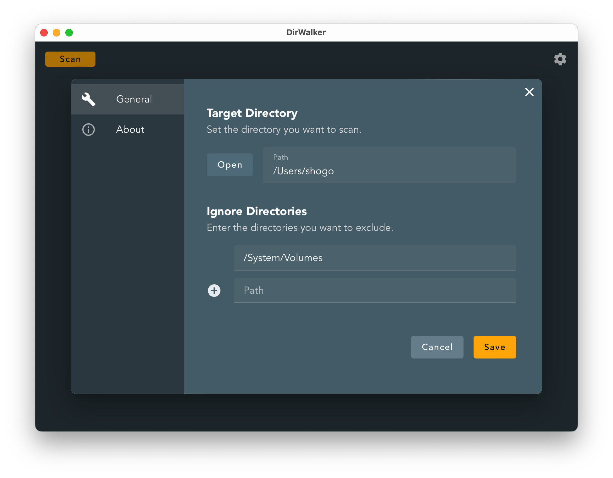
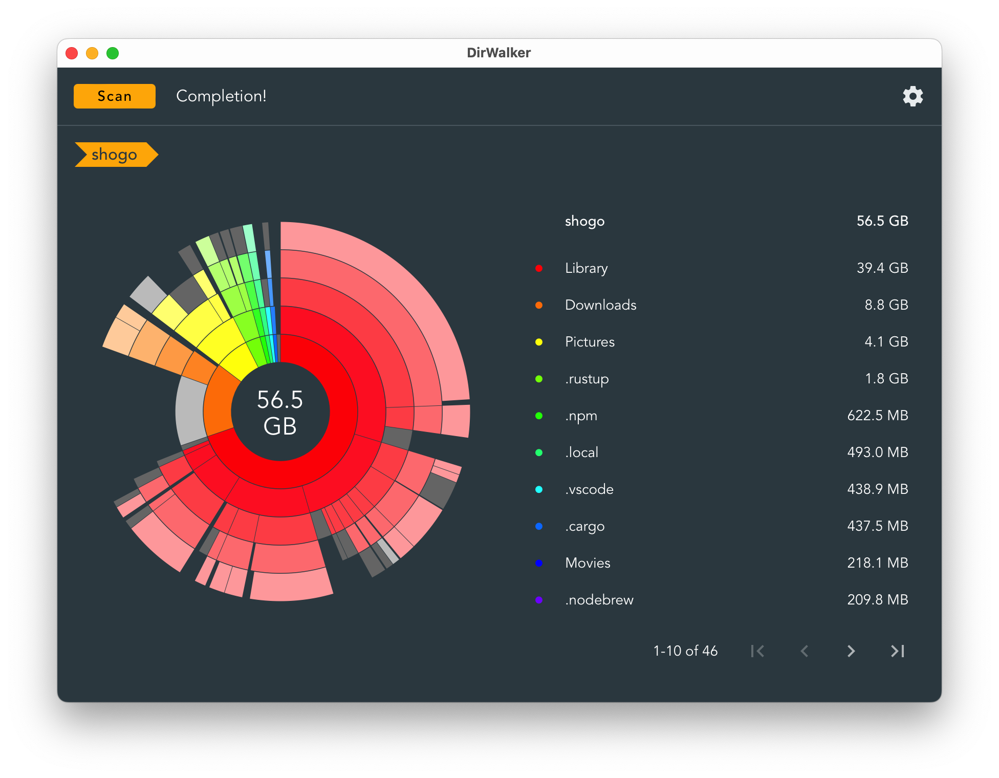
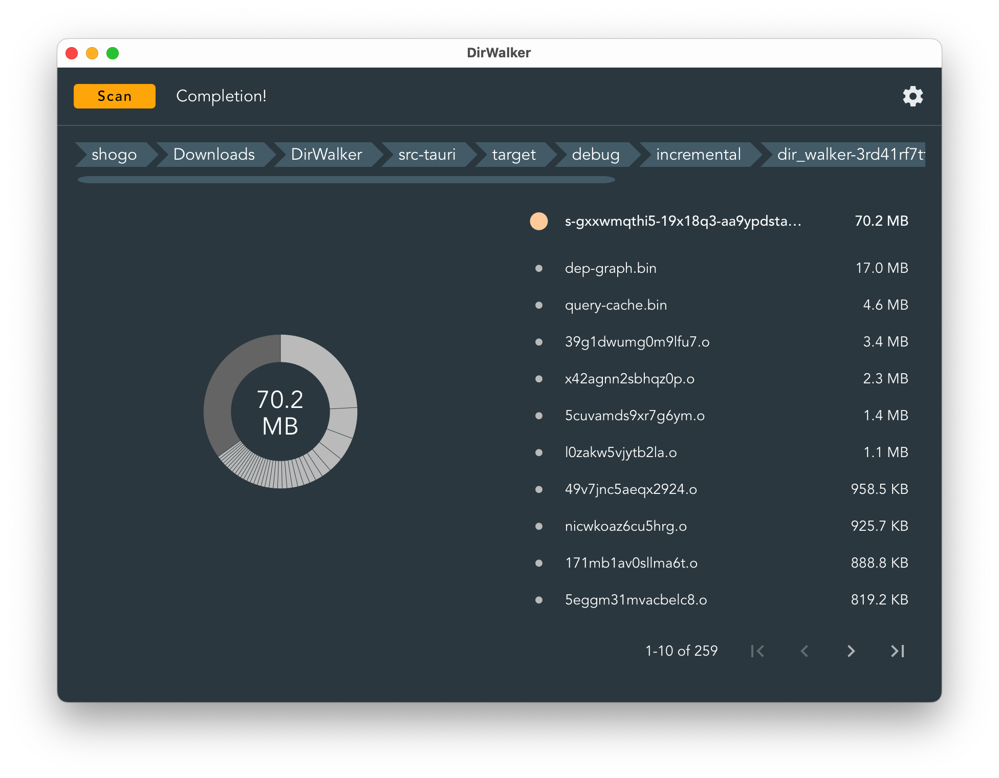

日本語版は[こちら](./README.md)<br><br>

# DirWalker

<div align="center">

<br>


<br>This is a tool that visualizes the usage of each directory using a sunburst chart.
<br>You can set the directories to scan and exclude.
<br>The frontend is processed with Vue3, and the backend is processed with Rust.

<br>
</div>

## Screenshots

<div align="center">



</div>

## How to build

### MacOS

Install rustup-init and nodebrew
```
brew install rustup-init
brew install nodebrew
```

Install the stable version of node.js (npm)
```
nodebrew install stable
```

Install tauri-cli
```
cargo install tauri-cli
```

Move to the working directory
```
cd DirWalker
```

Install the necessary packages (node_modules will be created)
```
npm install
```

Build (Debug)
```
cargo tauri dev
```

Build (Release)
```
cargo tauri build
```

<br>

## Contribution
Contributions to Issues and Pull Requests are welcome.<br>
If you find bugs or improvements, please feel free to send a Pull Request.<br>
Since Japanese is the main language, English translations are also welcome.<br>

<br>

## License
MIT License<br>
Copyright (c) 2024 Shogo Fukushima